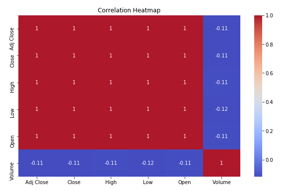
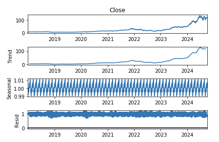

# 📈 Stock Price Prediction using LSTM

This project predicts stock prices using historical data and a Long Short-Term Memory (LSTM) neural network. The workflow includes data preprocessing, exploratory data analysis, and time series forecasting using deep learning techniques.

---

## 🚀 Features

### 🔍 Data Preprocessing
- **Handles Missing Data**: Ensures no gaps in the dataset by dropping or imputing missing values.
- **Date Parsing**: Converts date strings to `datetime` format and sets them as the index.
- **Numerical Conversion**: Converts all relevant columns to numeric types for consistency.

### 📊 Exploratory Data Analysis (EDA)
- **Closing Price Visualization**: Plots trends in closing stock prices over time.
- **Correlation Heatmap**: Displays relationships among features.
- **Time Series Decomposition**: Separates trends, seasonality, and residuals for better understanding.

### 📉 Time Series Analysis
- **Stationarity Check**: Uses the Augmented Dickey-Fuller (ADF) test to evaluate the stationarity of the time series.

### 🤖 LSTM Model
- **Sequential Model**: Builds an LSTM-based deep learning model for forecasting.
- **Dropout Layers**: Prevents overfitting by adding regularization layers.
- **Multi-Step Forecasting**: Predicts future stock prices using past trends.

---

## 🛠️ Technology Stack
- **Programming Language**: Python
- **Libraries**:
  - `numpy`, `pandas`: Data handling and manipulation
  - `matplotlib`, `seaborn`: Visualization
  - `statsmodels`: Time series decomposition and stationarity testing
  - `scikit-learn`: Data scaling
  - `tensorflow.keras`: Deep learning model development

---

## 📋 How to Run

1. **Install Dependencies**:
   ```bash
   pip install -r requirements.txt

   ## Screenshots

### Correlation Heatmap


### Actual vs Predicted Prices

